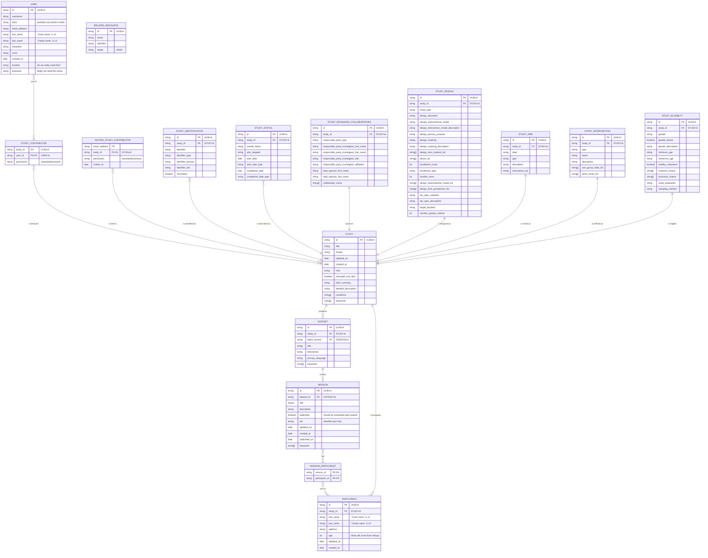

# Overview

A high-level class diagram of the database and the connections between entities are highlighted below. This is a work in progress and will be updated as the database is developed.

Diagram generated using [Mermaid](https://mermaid-js.github.io/mermaid/#/).
