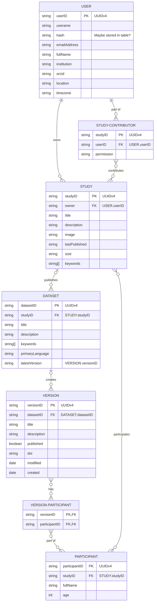

# Overview

A high level class diagram of the database and the connections between entitites are highlighted below. This is a work in progress and will be updated as the database is developed.

Diagram generated using [Mermaid](https://mermaid-js.github.io/mermaid/#/). Edit link can be found [here](https://mermaid.live/edit#pako:eNqtVclu2zAQ_RWCZ1vwKie6FG6cAEIax_ASoK17oMWxTVQiDZJK6u3fQy2W41Cpira8SBq-0bx5M0PucSAoYA-DHDCykiSac2TWZDobfN1n78lSWjK-Mo-Ybv0BGt2jOZ7N_MFzZ44tlHjhINFdipncjp1YgfQHJUDNdAiWlYIKJNtoJjiyNllEVrZLSJQexYuQqTVQmzXbWS7ff6CfsH0Rkqps6zjn2UtC2c48y6Ei8QREIpvemqi18Xsg2wUYm5BAEeNIk0UIn0r-AxFhYZ9SCUpZm8s4DIdlURhXRtA40c0uiQyYLUwoAlIK1yyCneDwTpq0K-o3j8Pp2P88mz6O_7ZDcjX_oEU2ICOmVEGy4DLqj6f-jT_qD6c2iw2RmgVsQ7iu5HJinJJJM3RyUwnYFp9xjYqWLNgN-tP-5LaEGSWaKPjPrCrnqLL732onzYzJ7RfCV3H5rGlQ-gmkSgcUP92OJ_7j0HnOLGeChRg5whajcKkQ4yxaKkcurlOY_02ShRAhEI42Hx4gVLCzzUQFFAnKluwtNDUHEsyDludf_23LvtWidndf2dIF5uLgQodDvS722aQiLzmK1Qezi47iAhoIbiItYlNda8LeYwsyBTjP8QQsSdm4mXPwQ0VOnpcec5yEQmJ5KnHG4JBh80ZICOW1Uxfjd8KdyHl5gQwK13BkjhbCqLn80mrMsV6DmWycRKWwJHGok6hHAyWxFpMtD7CnZQw1HG-Scuc3JvaWJFTGamrzTYiLb-zt8S_suW2n0eh0O91e1230rlo1vMVe_fraca_aZjVbzUbvutM81vAu_UHLabtNt9lrt9xe2-10axgoM_fGQ3ZZp3f28RUkYVeh).
